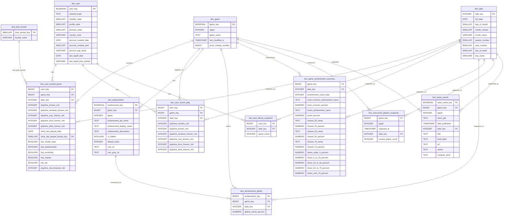

```mermaid
erDiagram

    dim_user {
        BIGSERIAL user_key PK
        TEXT steamid_hash
        SMALLINT visibility_state
        SMALLINT profile_state
        SMALLINT persona_state
        VARCHAR country_code
        DATE account_created_date
        SMALLINT account_created_year
        VARCHAR account_age_band
        DATE last_logoff_date
        VARCHAR last_logoff_time_bucket
    }

    dim_game {
        BIGSERIAL game_key PK
        INTEGER appid
        TEXT game_name
        TIMESTAMP last_modified_ts
        BIGINT price_change_number
    }

    dim_date {
        INTEGER date_key PK
        DATE full_date
        SMALLINT day_of_month
        SMALLINT month_number
        VARCHAR month_name
        SMALLINT quarter_number
        SMALLINT year_number
        SMALLINT day_of_week
        VARCHAR day_name
    }

    dim_time_bucket {
        SMALLINT time_bucket_key PK
        VARCHAR bucket_name
    }

    dim_achievement {
        BIGSERIAL achievement_key PK
        BIGINT game_key FK
        INTEGER appid
        TEXT achievement_api_name
        TEXT achievement_display_name
        TEXT achievement_description
        BOOLEAN is_hidden
        INTEGER default_value
        TEXT icon_url
        TEXT icon_gray_url
    }

    fact_user_owned_game {
        BIGINT user_key FK
        BIGINT game_key FK
        INTEGER date_key FK
        INTEGER playtime_forever_min
        INTEGER playtime_windows_forever_min
        INTEGER playtime_mac_forever_min
        INTEGER playtime_linux_forever_min
        INTEGER playtime_deck_forever_min
        DATE rtime_last_played_date
        SMALLINT rtime_last_played_bucket_key FK
        BOOLEAN has_visible_stats
        BOOLEAN has_leaderboards
        BOOLEAN has_workshop
        BOOLEAN has_market
        BOOLEAN has_dlc
        INTEGER playtime_disconnected_min
    }

    fact_user_recent_play {
        BIGINT user_key FK
        BIGINT game_key FK
        INTEGER date_key FK
        INTEGER playtime_2weeks_min
        INTEGER playtime_forever_min
        INTEGER playtime_windows_forever_min
        INTEGER playtime_mac_forever_min
        INTEGER playtime_linux_forever_min
        INTEGER playtime_deck_forever_min
    }

    fact_user_library_snapshot {
        BIGINT user_key FK
        INTEGER date_key FK
        INTEGER game_count
    }

    fact_achievement_global {
        BIGINT achievement_key FK
        BIGINT game_key FK
        INTEGER date_key FK
        NUMERIC global_unlock_percent
    }

    fact_game_achievement_summary {
        BIGINT game_key FK
        INTEGER date_key FK
        INTEGER achievement_count_total
        TEXT most_common_achievement_name
        NUMERIC most_common_percent
        TEXT rarest_achievement_name
        NUMERIC rarest_percent
        TEXT closest_25_name
        NUMERIC closest_25_percent
        TEXT closest_50_name
        NUMERIC closest_50_percent
        TEXT closest_75_name
        NUMERIC closest_75_percent
        NUMERIC share_under_5_percent
        NUMERIC share_5_to_25_percent
        NUMERIC share_25_to_50_percent
        NUMERIC share_50_to_75_percent
        NUMERIC share_over_75_percent
    }

    fact_concurrent_players_snapshot {
        BIGINT game_key FK
        INTEGER appid
        TIMESTAMP captured_at
        INTEGER date_key FK
        INTEGER current_player_count
    }

    fact_news_events {
        BIGSERIAL news_event_key PK
        BIGINT game_key FK
        INTEGER appid
        TEXT news_gid
        TIMESTAMP date_published
        INTEGER date_key FK
        TEXT title
        TEXT feed_label
        TEXT url
        TEXT author
        TEXT contents_short
    }

    dim_user ||--o{ fact_user_owned_game : has
    dim_user ||--o{ fact_user_recent_play : has
    dim_user ||--o{ fact_user_library_snapshot : has

    dim_game ||--o{ fact_user_owned_game : contains
    dim_game ||--o{ fact_user_recent_play : appears_in
    dim_game ||--o{ dim_achievement : has
    dim_game ||--o{ fact_achievement_global : tracks
    dim_game ||--o{ fact_game_achievement_summary : summarizes
    dim_game ||--o{ fact_concurrent_players_snapshot : measures
    dim_game ||--o{ fact_news_events : publishes

    dim_date ||--o{ fact_user_owned_game : snapshot_on
    dim_date ||--o{ fact_user_recent_play : snapshot_on
    dim_date ||--o{ fact_user_library_snapshot : snapshot_on
    dim_date ||--o{ fact_achievement_global : snapshot_on
    dim_date ||--o{ fact_game_achievement_summary : snapshot_on
    dim_date ||--o{ fact_concurrent_players_snapshot : captured_on
    dim_date ||--o{ fact_news_events : published_on

    dim_time_bucket ||--o{ fact_user_owned_game : last_play_bucket

    dim_achievement ||--o{ fact_achievement_global : measured_for
```