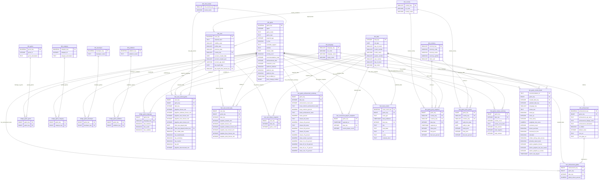

```mermaid
erDiagram

    dim_user {
        BIGSERIAL user_key PK
        TEXT steamid_hash
        SMALLINT visibility_state
        SMALLINT profile_state
        SMALLINT persona_state
        SMALLINT country_key FK
        DATE account_created_date
        SMALLINT account_created_year
        VARCHAR account_age_band
        DATE last_logoff_date
        SMALLINT last_logoff_time_bucket_key FK
    }

    dim_game {
        BIGSERIAL game_key PK
        INTEGER appid
        TEXT game_name
        TEXT game_type
        INTEGER required_age
        BOOLEAN is_free
        TEXT controller_support
        TEXT website
        DATE release_date
        BOOLEAN coming_soon
        INTEGER recommendations_total
        INTEGER achievements_total
        INTEGER metacritic_score
        BOOLEAN platform_windows
        BOOLEAN platform_mac
        BOOLEAN platform_linux
        TIMESTAMP last_modified_ts
        BIGINT price_change_number
    }

    dim_language {
        SMALLINT language_key PK
        VARCHAR iso_code
        VARCHAR language_name
        VARCHAR native_name
    }

    dim_country {
        SMALLINT country_key PK
        VARCHAR iso_code
        VARCHAR country_name
    }

    dim_currency {
        SMALLINT currency_key PK
        VARCHAR currency_code
        VARCHAR currency_name
        VARCHAR currency_symbol
        SMALLINT minor_unit
    }

    dim_date {
        INTEGER date_key PK
        DATE full_date
        SMALLINT day_of_month
        SMALLINT month_number
        VARCHAR month_name
        SMALLINT quarter_number
        SMALLINT year_number
        SMALLINT day_of_week
        VARCHAR day_name
    }

    dim_time_bucket {
        SMALLINT time_bucket_key PK
        VARCHAR bucket_name
    }

    dim_genre {
        BIGSERIAL genre_key PK
        INTEGER genre_id
        TEXT genre_description
    }

    dim_category {
        BIGSERIAL category_key PK
        INTEGER category_id
        TEXT category_description
    }

    dim_developer {
        BIGSERIAL developer_key PK
        TEXT developer_name
    }

    dim_publisher {
        BIGSERIAL publisher_key PK
        TEXT publisher_name
    }

    dim_achievement {
        BIGSERIAL achievement_key PK
        BIGINT game_key FK
        TEXT achievement_api_name
        TEXT achievement_display_name
        TEXT achievement_description
        BOOLEAN is_hidden
        INTEGER default_value
        TEXT icon_url
        TEXT icon_gray_url
    }

    bridge_game_genre {
        BIGINT game_key FK
        BIGINT genre_key FK
    }

    bridge_game_category {
        BIGINT game_key FK
        BIGINT category_key FK
    }

    bridge_game_developer {
        BIGINT game_key FK
        BIGINT developer_key FK
    }

    bridge_game_publisher {
        BIGINT game_key FK
        BIGINT publisher_key FK
    }

    bridge_game_language {
        BIGINT game_key FK
        SMALLINT language_key FK
        BOOLEAN has_interface
        BOOLEAN has_audio
        BOOLEAN has_subtitles
    }

    fact_achievement_global {
        BIGINT achievement_key FK
        BIGINT game_key FK
        INTEGER date_key FK
        NUMERIC global_unlock_percent
    }

    fact_user_owned_game {
        BIGINT user_key FK
        BIGINT game_key FK
        INTEGER date_key FK
        INTEGER playtime_forever_min
        INTEGER playtime_windows_forever_min
        INTEGER playtime_mac_forever_min
        INTEGER playtime_linux_forever_min
        INTEGER playtime_deck_forever_min
        DATE rtime_last_played_date
        SMALLINT rtime_last_played_bucket_key FK
        BOOLEAN has_visible_stats
        BOOLEAN has_leaderboards
        BOOLEAN has_workshop
        BOOLEAN has_market
        BOOLEAN has_dlc
        INTEGER playtime_disconnected_min
    }

    fact_user_recent_play {
        BIGINT user_key FK
        BIGINT game_key FK
        INTEGER date_key FK
        INTEGER playtime_2weeks_min
        INTEGER playtime_forever_min
        INTEGER playtime_windows_forever_min
        INTEGER playtime_mac_forever_min
        INTEGER playtime_linux_forever_min
        INTEGER playtime_deck_forever_min
    }

    fact_user_library_snapshot {
        BIGINT user_key FK
        INTEGER date_key FK
        INTEGER game_count
    }

    fact_game_achievement_summary {
        BIGINT game_key FK
        INTEGER date_key FK
        INTEGER achievement_count_total
        TEXT most_common_achievement_name
        NUMERIC most_common_percent
        TEXT rarest_achievement_name
        NUMERIC rarest_percent
        TEXT closest_25_name
        NUMERIC closest_25_percent
        TEXT closest_50_name
        NUMERIC closest_50_percent
        TEXT closest_75_name
        NUMERIC closest_75_percent
        NUMERIC share_under_5_percent
        NUMERIC share_5_to_25_percent
        NUMERIC share_25_to_50_percent
        NUMERIC share_50_to_75_percent
        NUMERIC share_over_75_percent
    }

    fact_concurrent_players_snapshot {
        BIGINT game_key FK
        TIMESTAMP captured_at
        INTEGER date_key FK
        INTEGER current_player_count
    }

    fact_news_events {
        BIGSERIAL news_event_key PK
        BIGINT game_key FK
        TEXT news_gid
        TIMESTAMP date_published
        INTEGER date_key FK
        TEXT title
        TEXT feed_label
        TEXT url
        TEXT author
        TEXT contents_short
    }

    fact_game_price_snapshot {
        BIGINT game_key FK
        SMALLINT country_key FK
        SMALLINT currency_key FK
        INTEGER date_key FK
        TIMESTAMP captured_at
        INTEGER initial_price
        INTEGER final_price
        INTEGER discount_percent
    }

    fact_game_price_period {
        BIGINT game_key FK
        SMALLINT country_key FK
        SMALLINT currency_key FK
        DATE valid_from_date
        DATE valid_to_date
        INTEGER initial_price
        INTEGER final_price
        INTEGER discount_percent
    }

    fact_game_review_summary {
        BIGINT game_key FK
        INTEGER date_key FK
        INTEGER review_score
        TEXT review_score_desc
        INTEGER total_positive
        INTEGER total_negative
        INTEGER total_reviews
    }

    fact_game_review_detail {
        TEXT recommendation_id PK
        BIGINT game_key FK
        INTEGER created_date_key FK
        INTEGER updated_date_key FK
        SMALLINT language_key FK
        TEXT review_text
        BOOLEAN voted_up
        INTEGER votes_up
        INTEGER votes_funny
        NUMERIC weighted_vote_score
        INTEGER comment_count
        BOOLEAN steam_purchase
        BOOLEAN received_for_free
        BOOLEAN refunded
        BOOLEAN written_during_early_access
        BOOLEAN primarily_steam_deck
        INTEGER author_playtime_forever
        INTEGER author_playtime_last_two_weeks
        INTEGER author_playtime_at_review
        TIMESTAMP author_last_played
    }

    dim_user ||--o{ fact_user_owned_game : owns
    dim_user ||--o{ fact_user_recent_play : played_recently
    dim_user ||--o{ fact_user_library_snapshot : has_library_snapshot

    dim_country ||--o{ dim_user : country_residence
    dim_country ||--o{ fact_game_price_snapshot : market_country
    dim_country ||--o{ fact_game_price_period : market_country

    dim_currency ||--o{ fact_game_price_snapshot : priced_in
    dim_currency ||--o{ fact_game_price_period : priced_in

    dim_game ||--o{ dim_achievement : defines
    dim_game ||--o{ bridge_game_genre : belongs_to_genre
    dim_game ||--o{ bridge_game_category : belongs_to_category
    dim_game ||--o{ bridge_game_developer : created_by
    dim_game ||--o{ bridge_game_publisher : published_by
    dim_game ||--o{ bridge_game_language : supports_language
    dim_game ||--o{ fact_user_owned_game : owned_in
    dim_game ||--o{ fact_user_recent_play : played_in
    dim_game ||--o{ fact_achievement_global : has_achievement_stats
    dim_game ||--o{ fact_game_achievement_summary : has_achievement_summary
    dim_game ||--o{ fact_concurrent_players_snapshot : has_player_snapshot
    dim_game ||--o{ fact_news_events : has_news
    dim_game ||--o{ fact_game_price_snapshot : has_price_snapshot
    dim_game ||--o{ fact_game_price_period : has_price_period
    dim_game ||--o{ fact_game_review_summary : has_review_summary
    dim_game ||--o{ fact_game_review_detail : has_reviews

    dim_genre ||--o{ bridge_game_genre : groups_games
    dim_category ||--o{ bridge_game_category : groups_games
    dim_developer ||--o{ bridge_game_developer : develops_games
    dim_publisher ||--o{ bridge_game_publisher : publishes_games
    dim_language ||--o{ bridge_game_language : available_in
    dim_language ||--o{ fact_game_review_detail : review_language

    dim_date ||--o{ fact_user_owned_game : snapshot_date
    dim_date ||--o{ fact_user_recent_play : snapshot_date
    dim_date ||--o{ fact_user_library_snapshot : snapshot_date
    dim_date ||--o{ fact_achievement_global : snapshot_date
    dim_date ||--o{ fact_game_achievement_summary : snapshot_date
    dim_date ||--o{ fact_concurrent_players_snapshot : captured_date
    dim_date ||--o{ fact_news_events : published_date
    dim_date ||--o{ fact_game_price_snapshot : price_date
    dim_date ||--o{ fact_game_review_summary : summary_date
    dim_date ||--o{ fact_game_review_detail : review_date

    dim_time_bucket ||--o{ dim_user : logoff_bucket
    dim_time_bucket ||--o{ fact_user_owned_game : last_play_bucket

    dim_achievement ||--o{ fact_achievement_global : measured_in
```